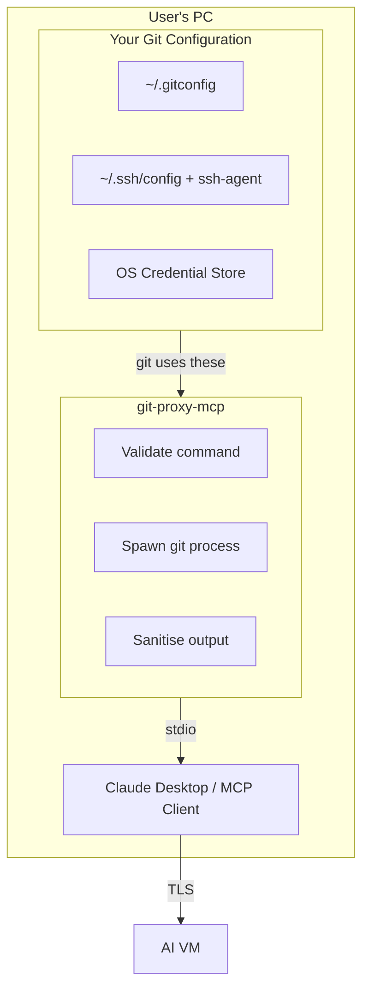

# git-proxy-mcp

**Your Git credentials stay on your machine. Always.**

A secure MCP server that lets AI assistants work with Git repositories using your existing Git configuration.

---

## Who Is This For?

- **Security-conscious developers** who want explicit control over credential flow
- **Enterprise/regulated environments** where compliance requires credentials to stay in-house
- **Self-hosters** already running local AI tooling who want the same control for Git
- **Anyone** who prefers "trust but verify" over "just trust"

---

## The Problem

**Credential exposure:** When AI coding assistants access your Git repositories, your credentials (PATs, SSH keys,
tokens) flow through layers you don't fully control. Even with trusted providers, that's a wider attack surface than
necessary.

**Workflow friction:** Existing solutions like GitHub's MCP server require AI assistants to work with files through
API calls. But AI assistants work better when they can transport repository files to their own environment, work on
them there, and push changes back. That's the natural Git workflow — clone, edit, commit, push — not file-by-file API
manipulation.

## The Solution

git-proxy-mcp acts as a local proxy between your AI assistant and Git hosting services. It:

- **Uses your existing Git setup** — No separate credential configuration; works with your credential helpers and SSH agent
- **Keeps credentials local** — Credentials never flow through MCP responses
- **Enables native Git workflow** — Clone, edit, commit, push. AI assistants work with full repo copies, not API calls
- **Runs locally** — stdio transport means no network exposure between the MCP server and client



---

## Supported Commands

Only remote Git operations are proxied:

| Command | Description |
|---------|-------------|
| `clone` | Clone a repository |
| `fetch` | Download objects and refs from a remote |
| `pull` | Fetch and integrate with a remote |
| `push` | Update remote refs |
| `ls-remote` | List references in a remote repository |

**Local commands** (`status`, `log`, `diff`, `add`, `commit`, `branch`, etc.) are intentionally **not supported**.
AI assistants can run these directly — they don't need to be proxied.

---

## Features

| Feature | Status |
|---------|--------|
| Credential-free proxy | Complete |
| GitHub/GitLab support | Complete |
| Remote-only command proxy | Complete |
| SSH key support (via ssh-agent) | Complete |
| Audit logging | Complete |
| Protected branch guardrails | Complete |
| Rate limiting | Complete |
| Git LFS support | Future |

> See [TODO.md](TODO.md) for the full roadmap.

---

## Installation

### Download Pre-built Binaries

Download the latest release for your platform from the
[Releases page](https://github.com/MatejGomboc/git-proxy-mcp/releases):

| Platform | Download |
|----------|----------|
| Linux (x64) | `git-proxy-mcp-linux-x86_64.tar.gz` |
| macOS (Intel) | `git-proxy-mcp-macos-x86_64.tar.gz` |
| macOS (Apple Silicon) | `git-proxy-mcp-macos-aarch64.tar.gz` |
| Windows (x64) | `git-proxy-mcp-windows-x86_64.zip` |

#### Linux / macOS

```bash
# Download and extract (example for Linux x64)
curl -LO https://github.com/MatejGomboc/git-proxy-mcp/releases/latest/download/git-proxy-mcp-linux-x86_64.tar.gz
tar -xzf git-proxy-mcp-linux-x86_64.tar.gz

# Move to a directory in your PATH
sudo mv git-proxy-mcp /usr/local/bin/

# Verify installation
git-proxy-mcp --version
```

#### Windows

1. Download `git-proxy-mcp-windows-x86_64.zip`
2. Extract to a folder (e.g., `C:\Program Files\git-proxy-mcp\`)
3. Add the folder to your PATH environment variable
4. Open a new terminal and run `git-proxy-mcp --version`

### Build from Source

Requires Rust 1.75+ and Git 2.x.

```bash
# Clone the repository
git clone https://github.com/MatejGomboc/git-proxy-mcp.git
cd git-proxy-mcp

# Build
cargo build --release

# The binary is at target/release/git-proxy-mcp (or .exe on Windows)
./target/release/git-proxy-mcp --version
```

### Verify Checksums

Each release includes a `SHA256SUMS.txt` file. Verify your download:

```bash
# Linux/macOS
sha256sum -c SHA256SUMS.txt --ignore-missing

# Windows (PowerShell)
Get-FileHash git-proxy-mcp-windows-x86_64.zip -Algorithm SHA256
```

---

## Prerequisites: Configure Git

**git-proxy-mcp does not store credentials.** It uses your existing Git configuration.

Before using git-proxy-mcp, ensure Git is configured to authenticate without prompting:

### For HTTPS (GitHub, GitLab, etc.)

Configure a credential helper to cache your tokens:

```bash
# macOS - use Keychain
git config --global credential.helper osxkeychain

# Windows - use Credential Manager
git config --global credential.helper manager

# Linux - use libsecret (GNOME) or cache
git config --global credential.helper libsecret
# or: git config --global credential.helper cache --timeout=3600
```

Then authenticate once (e.g., `git clone` a private repo). Your token will be stored securely.

### For SSH

Add your SSH key to the ssh-agent:

```bash
# Start ssh-agent (if not already running)
eval "$(ssh-agent -s)"

# Add your key (you'll be prompted for passphrase once)
ssh-add ~/.ssh/id_ed25519

# macOS: store passphrase in Keychain
ssh-add --apple-use-keychain ~/.ssh/id_ed25519
```

On Windows with OpenSSH, the ssh-agent service handles key caching automatically.

### Verify Setup

Test that Git can authenticate without prompting:

```bash
# Should work without password prompt
git ls-remote https://github.com/your-private-repo.git

# Or for SSH
git ls-remote git@github.com:your-private-repo.git
```

If prompted for credentials, the MCP server will fail (it sets `GIT_TERMINAL_PROMPT=0` to prevent hanging).

---

## Configuration

The MCP server uses a minimal configuration file for security settings. The default location is:

- **Linux/macOS:** `~/.git-proxy-mcp/config.json`
- **Windows:** `%USERPROFILE%\.git-proxy-mcp\config.json`

Or specify a custom path with `--config /path/to/config.json`.

### Example Configuration

```json
{
    "security": {
        "allow_force_push": false,
        "protected_branches": ["main", "master", "develop"]
    },
    "logging": {
        "level": "warn"
    }
}
```

### Configuration Options

| Option | Description | Default |
|--------|-------------|---------|
| `security.allow_force_push` | Allow force push operations | `false` |
| `security.protected_branches` | Branches that cannot be force-pushed or deleted | `[]` |
| `security.repo_allowlist` | Only allow these repository patterns (glob) | `null` (all allowed) |
| `security.repo_blocklist` | Block these repository patterns (glob) | `null` (none blocked) |
| `logging.level` | Log level: trace, debug, info, warn, error | `warn` |
| `logging.audit_log_path` | Path to audit log file | `null` (disabled) |

See [config/example-config.json](config/example-config.json) for a complete example.

---

## Usage with MCP Clients

### Claude Desktop

Add to your Claude Desktop MCP configuration file:

- **macOS:** `~/Library/Application Support/Claude/claude_desktop_config.json`
- **Windows:** `%APPDATA%\Claude\claude_desktop_config.json`

```json
{
    "mcpServers": {
        "git-proxy": {
            "command": "git-proxy-mcp",
            "args": []
        }
    }
}
```

#### Platform-Specific Examples

**macOS / Linux:**

```json
{
    "mcpServers": {
        "git-proxy": {
            "command": "/usr/local/bin/git-proxy-mcp",
            "args": []
        }
    }
}
```

**Windows:**

```json
{
    "mcpServers": {
        "git-proxy": {
            "command": "C:\\Program Files\\git-proxy-mcp\\git-proxy-mcp.exe",
            "args": []
        }
    }
}
```

### Other MCP Clients

git-proxy-mcp uses stdio transport, compatible with any MCP client that supports local server processes.

The server exposes a `git` tool that accepts Git commands as arguments. Example tool call:

```json
{
    "name": "git",
    "arguments": {
        "command": "clone",
        "args": ["https://github.com/user/repo.git", "/tmp/repo"]
    }
}
```

---

## Security Model

**Core guarantee:** The MCP server spawns git as a subprocess using your existing configuration. Credentials are
never stored in the MCP server or transmitted through MCP responses.

### What flows to the AI

- Repository file contents
- Commit history and metadata
- Branch and tag information
- Operation status (success/failure)

### What stays local

- Personal Access Tokens (in your OS credential store)
- SSH private keys (in ssh-agent)
- Any authentication secrets
- Output is sanitised to remove any accidentally leaked credentials

### Audit it yourself

This project is open source under GPL-3.0. Review the code, verify the credential handling, and build from source if you prefer.

---

## Contributing

Contributions are welcome! Please read [CONTRIBUTING.md](CONTRIBUTING.md) for guidelines.

- Follow the style guide in [STYLE.md](STYLE.md)
- Security issues: see [SECURITY.md](SECURITY.md)

---

## Licence

Copyright (C) 2025 Matej Gomboc <https://github.com/MatejGomboc/git-proxy-mcp>.

This program is free software: you can redistribute it and/or modify
it under the terms of the GNU General Public License as published by
the Free Software Foundation, either version 3 of the License, or
(at your option) any later version.

This program is distributed in the hope that it will be useful,
but WITHOUT ANY WARRANTY; without even the implied warranty of
MERCHANTABILITY or FITNESS FOR A PARTICULAR PURPOSE. See the
GNU General Public License for more details.

See the attached [LICENCE](LICENCE) file for more info.

---

## Links

- [MCP Specification](https://modelcontextprotocol.io/)
- [Error Reference](docs/errors.md)
- [Report an Issue](https://github.com/MatejGomboc/git-proxy-mcp/issues)
