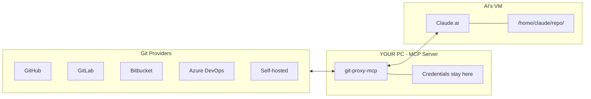
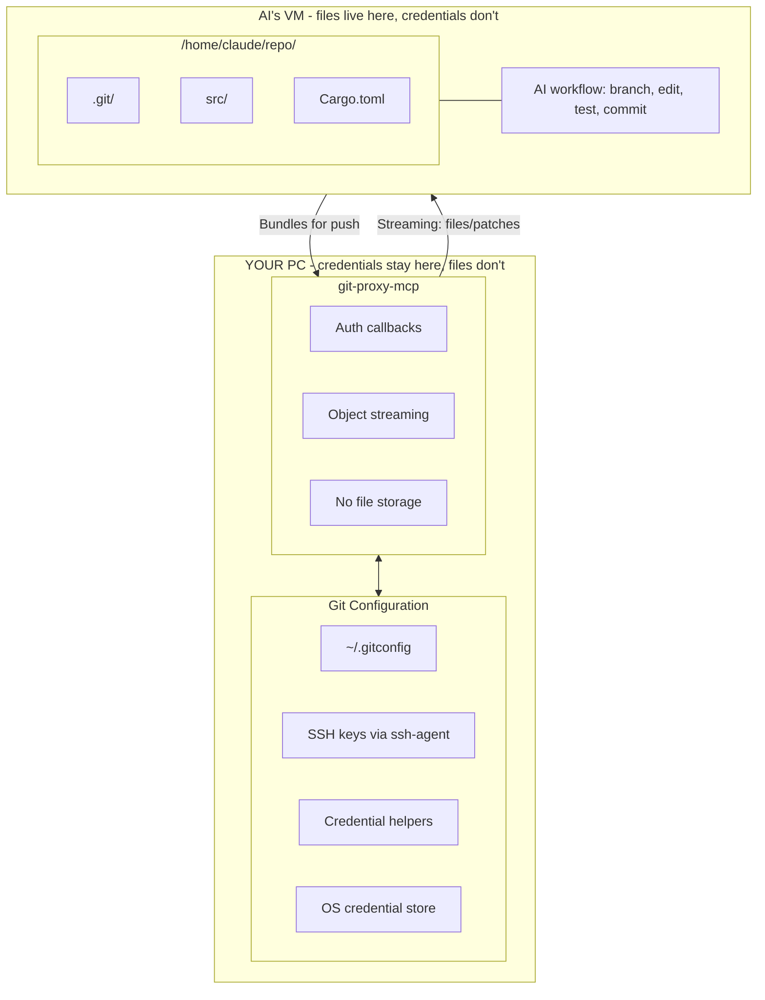

# git-proxy-mcp

**Your Git credentials stay on your machine. Your repo lives in the AI's workspace.**

A secure MCP server that lets cloud-based AI assistants (Claude.ai, ChatGPT, Gemini, etc.)
work with private Git repositories using your existing Git credentials — without those
credentials ever leaving your machine.

---

## The Problem

Cloud-based AI coding assistants face a fundamental dilemma:

| Approach | Problem |
|----------|--------|
| **GitHub MCP Server** | File-by-file API calls. 50 files = 50 calls. Can't run tests. Painfully slow. |
| **Give AI your credentials** | Security nightmare. Your PATs/SSH keys in someone else's cloud. |
| **Only use public repos** | Most real work is on private repositories. |

**The result:** AI assistants that can write code but can't actually work on your projects like a real developer would.

## The Solution

git-proxy-mcp acts as an **authenticated streaming proxy** between Git providers and AI workspaces:


```mermaid
flowchart LR
    subgraph providers["Git Providers"]
        GitHub
        GitLab
        Bitbucket
        Azure["Azure DevOps"]
        Self["Self-hosted"]
    end

    subgraph pc["YOUR PC - MCP Server"]
        MCP["git-proxy-mcp"]
        Creds["Credentials stay here"]
    end

    subgraph ai["AI's VM"]
        Claude["Claude.ai"]
        Repo["/home/claude/repo/"]
    end

    providers <--> MCP
    MCP <--> Claude
    MCP --- Creds
    Claude --- Repo
```

**Key insight:** The AI has its own VM with full Linux capabilities. It just can't authenticate to your private repos. We solve *only* that problem.

### How It Works

1. **Clone:** AI requests a repo → MCP server authenticates → streams files directly to AI's VM
2. **Work:** AI has a complete local git repo. Branch, edit, test, commit — all native.
3. **Push:** AI sends commits → MCP server authenticates → pushes to remote

**Credentials never leave your machine. Files never touch your machine.**

---

## Who Is This For?

| Environment | Local Git? | Needs This? | Why |
|-------------|------------|-------------|-----|
| **Claude.ai** | ❌ Cloud VM | ✅ **YES** | Has compute, lacks credentials |
| **ChatGPT + Code Interpreter** | ❌ Sandboxed | ✅ **YES** | Same situation |
| **Gemini + code execution** | ❌ Sandboxed | ✅ **YES** | Same situation |
| **Any cloud AI with VM** | ❌ | ✅ **YES** | Universal solution |
| Claude Code | ✅ Local | ❌ No | Already has direct access |
| Cursor | ✅ Local | ❌ No | Runs on your machine |
| GitHub Copilot | ✅ Local | ❌ No | IDE extension |

---

## Comparison: GitHub MCP vs git-proxy-mcp

| Operation | GitHub MCP Server | git-proxy-mcp |
|-----------|-------------------|---------------|
| Clone 100 files | 100 API calls, minutes | 1 streaming call, seconds |
| Run `cargo test` | ❌ Impossible | ✅ Native in AI's VM |
| Interactive rebase | ❌ Impossible | ✅ `git rebase -i` |
| Branch + edit + commit + push | 4+ API calls | Work locally, 1 push |
| View git log/diff | API calls | Instant local commands |
| Large repositories | Timeout hell | Shallow clone, sparse checkout |
| Rate limits | Hit constantly | Just auth, minimal API use |

---

## Architecture

### Security Model


```mermaid
flowchart TB
    subgraph pc["YOUR PC - credentials stay here, files don't"]
        subgraph mcp["git-proxy-mcp"]
            Auth["Auth callbacks"]
            Stream["Object streaming"]
            NoStore["No file storage"]
        end

        subgraph config["Git Configuration"]
            GitConfig["~/.gitconfig"]
            SSH["SSH keys via ssh-agent"]
            CredHelper["Credential helpers"]
            OSStore["OS credential store"]
        end

        mcp <--> config
    end

    subgraph aivm["AI's VM - files live here, credentials don't"]
        subgraph repo["/home/claude/repo/"]
            Git[".git/"]
            Src["src/"]
            Cargo["Cargo.toml"]
        end

        Workflow["AI workflow: branch, edit, test, commit"]
        repo --- Workflow
    end

    mcp -->|"Streaming: files/patches"| aivm
    aivm -->|"Bundles for push"| mcp
```

### What Flows Where

| Data | Your PC | Network | AI's VM |
|------|---------|---------|--------|
| Credentials (PAT, SSH keys) | ✅ Stays | ❌ Never | ❌ Never |
| Repository files | ❌ Never stored | Streamed | ✅ Lives here |
| Git objects/history | ❌ Never stored | Streamed | ✅ Lives here |
| Commits/patches | ❌ Temporary only | Streamed | ✅ Created here |

---

## MCP Tools

### Tier 1: Single-Response Tools

#### `repo/clone`

Stream a repository to the AI's workspace (small-to-medium repos).

```json
{
  "name": "repo/clone",
  "arguments": {
    "url": "https://github.com/user/private-repo",
    "branch": "main",
    "depth": 1,
    "sparse": ["src/", "Cargo.toml"]
  }
}
```

**Response:** Base64-encoded tar.gz with commit SHA and file count.

#### `repo/push`

Push a git bundle from AI's workspace to remote.

```json
{
  "name": "repo/push",
  "arguments": {
    "url": "https://github.com/user/private-repo",
    "branch": "feature/fix-bug",
    "bundle": "<base64-encoded git bundle>",
    "force": false
  }
}
```

**Response:** Pushed commit SHA and branch name.

### Tier 2: Chunked Streaming Tools (Large Repos)

For repositories too large to transfer in a single response.

#### `repo/clone_start`

Start a chunked clone session.

```json
{
  "name": "repo/clone_start",
  "arguments": {
    "url": "https://gitlab.com/org/large-repo",
    "branch": "main",
    "depth": 1,
    "chunk_size": 1048576
  }
}
```

**Response:** Session ID, total chunks, total size.

#### `repo/clone_chunk`

Get a chunk from a streaming session.

```json
{
  "name": "repo/clone_chunk",
  "arguments": {
    "session_id": "stream_abc123",
    "chunk_index": 0
  }
}
```

**Response:** Base64-encoded chunk data, is_last flag.

#### `repo/clone_cancel`

Cancel a streaming session (optional, auto-expires after 1 hour).

```json
{
  "name": "repo/clone_cancel",
  "arguments": {
    "session_id": "stream_abc123"
  }
}
```

### Other Tools

#### `repo/pull`

Sync new changes from remote to AI's workspace.

```json
{
  "name": "repo/pull",
  "arguments": {
    "url": "https://github.com/user/private-repo",
    "branch": "main",
    "since_commit": "abc123"
  }
}
```

**Response:** Streamed delta of changed files.

#### `repo/diff`

Get diff between two commits.

```json
{
  "name": "repo/diff",
  "arguments": {
    "url": "https://github.com/user/private-repo",
    "base_commit": "abc123",
    "head_commit": "def456"
  }
}
```

**Response:** Diff content with stats.

#### `repo/refs`

List remote branches and tags.

```json
{
  "name": "repo/refs",
  "arguments": {
    "url": "https://github.com/user/private-repo"
  }
}
```

**Response:** List of refs with commit SHAs.

---

## Installation

### Prerequisites

Configure Git to authenticate without prompting:

```bash
# macOS
git config --global credential.helper osxkeychain

# Windows
git config --global credential.helper manager

# Linux
git config --global credential.helper libsecret
```

For SSH, ensure your key is in ssh-agent:

```bash
eval "$(ssh-agent -s)"
ssh-add ~/.ssh/id_ed25519
```

### Usage with Claude Desktop

Add to your Claude Desktop MCP configuration:

```json
{
  "mcpServers": {
    "git-proxy": {
      "command": "git-proxy-mcp",
      "args": []
    }
  }
}
```

---

## Configuration

Minimal configuration file:

- **Linux/macOS:** `~/.git-proxy-mcp/config.json`
- **Windows:** `%USERPROFILE%\.git-proxy-mcp\config.json`

```json
{
  "security": {
    "allow_force_push": false,
    "protected_branches": ["main", "master"]
  },
  "logging": {
    "level": "warn",
    "audit_log_path": "~/.git-proxy-mcp/audit.log"
  }
}
```

---

## Contributing

Contributions welcome! See [CONTRIBUTING.md](CONTRIBUTING.md) for guidelines.

- Follow the style guide in [STYLE.md](STYLE.md)
- Security issues: see [SECURITY.md](SECURITY.md)

---

## Licence

Copyright (C) 2026 Matej Gomboc <https://github.com/MatejGomboc/git-proxy-mcp>.

GNU General Public License v3.0 — see [LICENCE](LICENCE).

---

## Links

- [MCP Specification](https://modelcontextprotocol.io/)
- [git2 (libgit2 Rust bindings)](https://crates.io/crates/git2)
- [Report an Issue](https://github.com/MatejGomboc/git-proxy-mcp/issues)
