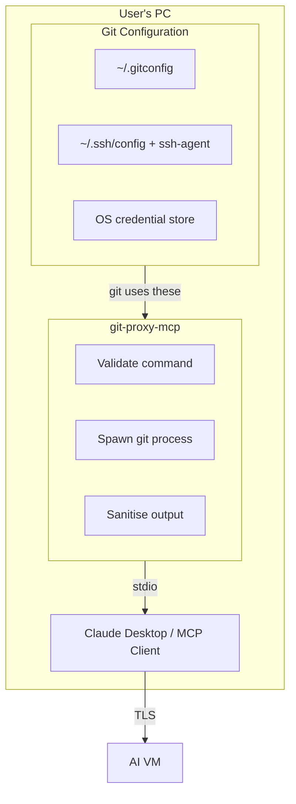

# TODO — Development Battle Plan

## Overview

**Goal:** Build a secure, AI-agnostic Git proxy MCP server in Rust that spawns git commands on behalf of AI
assistants, using the user's existing git credential configuration.

**Guiding Principles:**

- Security over speed. Take the time to do it right.
- Work on ONE feature at a time.
- Follow the style guide in `STYLE.md` and contributor guidelines in `CONTRIBUTING.md`.

**For AI Assistants:** See `.claude/CLAUDE.md` for project context.

---

## Security Architecture

### Credential-Free Proxy Design



**Key Security Properties:**

1. MCP server stores NO credentials — uses git's native credential system
2. User configures git once, same as they would for manual use
3. stdio transport = local process communication, no network exposure
4. Only git output flows through MCP, sanitised for safety

---

## Design Decisions (Locked In)

| Decision | Choice | Rationale |
|----------|--------|----------|
| Credential storage | None | Use git's native credential helpers; no duplication |
| Config hot-reload | No | Security: config changes require restart |
| Concurrent operations | Yes | Allow multiple repos to be accessed simultaneously |
| Transport | stdio only (v1) | Simplest, most secure for local MCP clients |
| SSH keys | User manages via ssh-agent | Standard tooling, no MCP involvement |
| Git LFS | Defer to v1.1 | v1.0: detect & warn; v1.1+: implement support |
| Proxy approach | Pass-through | Spawn git subprocess, return output |
| Scope | Git CLI only | Web UI features (PRs, issues, etc.) are out of scope |
| Command scope | Remote-only | Only clone/fetch/pull/push/ls-remote |

---

## Completed: Phase 5 — Remove Credential Storage

Major architectural simplification completed. The MCP server no longer stores credentials.
Instead, it relies on the user's existing Git configuration (credential helpers, SSH agent).

- [x] Remove `src/auth/` module entirely
- [x] Remove `remotes` section from config
- [x] Simplify `GitExecutor` to just spawn git
- [x] Remove `secrecy` crate dependency
- [x] Update config to security/logging settings only
- [x] Update README with credential-free approach
- [x] Update example config
- [x] Fix all tests

---

## Completed: Phase 6 — Code Quality & Cleanup

- [x] Optimise tokio features (currently using "full", only need subset)
- [x] Audit codebase for British spelling consistency (see CONTRIBUTING.md)
- [x] Convert ASCII diagrams to Mermaid (TODO.md, README.md)

---

## Completed: Phase 7 — Testing & Documentation

- [x] Tests for large git output handling
- [x] Documentation for error messages and error codes

---

## Phase 8: Robustness & Production Readiness <- CURRENT

- [x] Request timeout configuration (prevent hung git processes)
- [ ] Graceful shutdown handling (SIGTERM/SIGINT)
- [ ] Output size limits (prevent protocol buffer overflow)
- [ ] Configurable rate limiting (currently hardcoded: 20 burst, 5/sec)
- [ ] Documentation: mention per-repo git config (without `--global`) as alternative
- [ ] Rust code: add explicit type annotations where types aren't obvious

---

## Phase 9: Cross-Platform Release

- [x] GitHub Actions release workflow
- [x] Build targets (Windows x64, macOS x64/ARM64, Linux x64)
- [ ] Binary signing (if applicable)
- [x] Semantic versioning and CHANGELOG maintenance
- [x] User documentation (installation guide, configuration reference)
- [x] Example MCP client configurations (Claude Desktop, etc.)

> **Note:** The repository owner decides when to move from pre-release (v0.x) to stable release (v1.0).
> This decision should be based on real-world usage, security audits, and feature completeness.

---

## Future Considerations (v1.1+)

### AI Commit Author Identity

Allow AI commits to show a separate contributor identity on GitHub while still using the
human's credentials for push authentication. This provides clear audit trail of human vs
AI contributions.

**How it works:**

| Aspect | Who | How |
|--------|-----|-----|
| Push authentication | Human user | OS credential store / SSH agent (unchanged) |
| Commit author | AI bot account | `GIT_AUTHOR_NAME` / `GIT_AUTHOR_EMAIL` env vars |

**Workflow:**

1. Human clones repo (as `MatejGomboc`)
2. AI codes & commits via git-proxy-mcp (as `MatejGomboc-Claude-MCP`)
3. AI creates PR via GitHub MCP server
4. Human reviews & approves

**Configuration:**

```json
{
  "ai_identity": {
    "author_name": "MatejGomboc-Claude-MCP",
    "author_email": "matejgomboc-claude-mcp@users.noreply.github.com"
  }
}
```

**Benefits:**

- Clear audit trail — anyone can see which code is AI-generated
- Clean GitHub contributor stats — human vs AI contributions separated
- Accountability — human approves all AI code before merge
- **Still credential-free** — only sets author metadata, no tokens stored

**Implementation notes:**

- Set `GIT_AUTHOR_NAME` and `GIT_AUTHOR_EMAIL` before spawning git
- `GIT_COMMITTER_*` stays as user's identity (from git config)
- Author email must match a GitHub account for avatar/link to appear
- Feature should be optional and disabled by default

---

### Other Future Features

- Git LFS support (currently detect & warn only)
- Structured logging with JSON output option
- Metrics/telemetry endpoint
- Per-operation audit trail with session tracking
- Health check endpoint for monitoring

---

## References

- **MCP Specification:** <https://modelcontextprotocol.io/>
- **Open Source Guides:** <https://opensource.guide/>
- **Claude Code Docs:** <https://docs.anthropic.com/en/docs/claude-code>
- **Swatinem/rust-cache:** <https://github.com/Swatinem/rust-cache>
- **EditorConfig:** <https://editorconfig.org/>

---

*Last updated: 2026-01-01*
